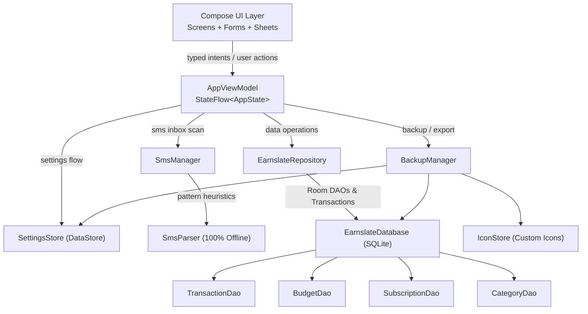
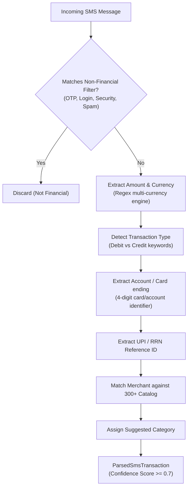

# Earnslate - Developer Documentation

> Architecture, implementation notes, conventions, and verification guidance for Earnslate development.

**Version:** 2.0.0 | **Last Updated:** 2026-08-18
**Scope:** Internal development, financial data architecture, SMS parsing engine, UI paradigms, testing, and release maintenance.

---

## Table of Contents

- [Architecture Overview](#architecture-overview)
- [Technology Stack](#technology-stack)
- [Project Structure](#project-structure)
- [Runtime Flow](#runtime-flow)
- [Core Concepts & Financial Models](#core-concepts--financial-models)
- [Navigation & State Architecture](#navigation--state-architecture)
- [Persistence & Database Layer](#persistence--database-layer)
- [Smart SMS Parsing Engine](#smart-sms-parsing-engine)
- [Backup, Restore & Data Portability](#backup-restore--data-portability)
- [UI & Design System](#ui--design-system)
- [Feature Modules Deep Dive](#feature-modules-deep-dive)
- [Naming Conventions](#naming-conventions)
- [Configuration & Build System](#configuration--build-system)
- [Security & Privacy Practices](#security--privacy-practices)
- [Error Handling & Recovery](#error-handling--recovery)
- [Testing Suite](#testing-suite)
- [Build & Release Engineering](#build--release-engineering)
- [Troubleshooting & Maintenance](#troubleshooting--maintenance)
- [Feedback](#feedback)

---

## Architecture Overview

Earnslate is built with a **clean, reactive MVVM architecture** powered by Jetpack Compose, Kotlin Coroutines, Hilt dependency injection, Room SQLite persistence, and Jetpack DataStore Preferences.



### Key Architectural Decisions

| Decision | Rationale |
|----------|-----------|
| **Jetpack Compose Single-Module Architecture** | Keeps UI completely declarative, simplifies state hoisting, eliminates XML view boilerplate, and enables fast compilation and seamless previewing. |
| **Offline-First by Design** | The Android manifest intentionally omits `android.permission.INTERNET`. All financial computations, storage, categorization, and SMS parsing operate locally on-device. |
| **Room Database with Upsert Contracts** | SQLite storage backed by Room `@Upsert` operations and transactional helpers guarantees ACID compliance across transaction, budget, subscription, and category tables. |
| **DataStore Preferences for App Settings** | User preferences (theme, currency, locale, accent, haptics) are stored in Jetpack DataStore Preferences with atomic JSON serialization for zero-flicker startup. |
| **On-Device Regex Heuristic SMS Engine** | Financial transactional SMS parsing runs 100% offline through structured regex heuristics, filtering OTPs/spam and extracting amounts, accounts, merchants, and categories without external NLP dependencies. |
| **Transactional Backup with Asset Bundling** | JSON backup files (`v2.0.0` envelope) package complete application state alongside base64-encoded, sanitized custom subscription icons with atomic database rollback on import failure. |
| **MaterialKolor Dynamic Palette Engine** | Harmonizes color schemes with dynamic Android 12+ wallpaper palettes or 10 custom selectable accent themes with full OLED pure-black support. |
| **Responsive Dual-Mode Navigation** | Automatically adapts between a floating pill navigation bar on compact mobile devices and a side `NavigationRail` on medium/expanded tablets (`>= 840dp`). |

---

## Technology Stack

| Area | Technology |
|------|------------|
| Language and toolchain | Kotlin 2.2.10, Java 21 Gradle daemon, JVM 11 bytecode target, Gradle 9.2.1, Android Gradle Plugin 9.2.1, KSP 2.3.2 |
| Android platform | compileSdk 37, targetSdk 37, minSdk 24 (Android 7.0+), AndroidX Core KTX 1.18.0, Lifecycle 2.10.0, Activity Compose 1.13.0 |
| UI & Styling | Jetpack Compose BOM 2026.05.00, Material 3 1.5.0-alpha19, Material 3 Adaptive 1.2.0, MaterialKolor 4.1.1, Simple Icons 1.1.1, Coil 2.7.0 |
| Architecture & State | MVVM, Kotlin Coroutines 1.11.0, StateFlow, Dagger Hilt 2.59.2, Hilt Navigation Compose 1.3.0 |
| Navigation | Navigation Compose 2.9.7 with animated horizontal transitions and modal dialogs |
| Persistence & Data | Room 2.8.4 (SQLite), DataStore Preferences 1.2.1, Kotlinx Serialization 1.11.0 |
| Testing Suite | JUnit 4.13.2, AndroidX Test JUnit 1.3.0, Espresso Core 3.7.0, Robolectric 4.16.1, MockK 1.14.9, Turbine 1.2.1 |

Versions are centralized in `earnslate-android/gradle/libs.versions.toml`.

---

## Project Structure

Earnslate is organized into a primary native Android application module, an archived web codebase for future multiplatform/sync initiatives, project documentation, and marketing assets:

```text
earnslate/
├── assets/                                      # Project branding & screenshots
│   └── Earnslate.png
├── docs/                                        # Landing page website (GitHub Pages)
│   ├── assets/
│   ├── index.html
│   ├── scripts.js
│   └── styles.css
├── earnslate-web/                               # Archived web app (Next.js / TypeScript / LocalStorage)
│   ├── src/
│   ├── CHANGELOG.md
│   ├── DEVELOPMENT.md
│   ├── README.md
│   └── package.json
├── earnslate-android/                           # Native Android application
│   ├── gradle/
│   │   ├── wrapper/
│   │   └── libs.versions.toml                   # Centralized version catalog
│   ├── app/
│   │   ├── proguard-rules.pro                   # R8 / ProGuard optimization rules
│   │   ├── build.gradle.kts                     # App module configuration & dependencies
│   │   └── src/
│   │       ├── main/
│   │       │   ├── AndroidManifest.xml          # App manifest (no INTERNET permission)
│   │       │   ├── java/dev/qtremors/earnslate/
│   │       │   │   ├── EarnslateApplication.kt  # Application entry & Hilt AndroidApp
│   │       │   │   ├── MainActivity.kt          # Main Activity & Edge-to-Edge setup
│   │       │   │   ├── data/
│   │       │   │   │   ├── Model.kt             # Data classes, enums, & ServiceTemplates
│   │       │   │   │   ├── Database.kt          # Room Database, DAOs, & Converters
│   │       │   │   │   ├── SettingsStore.kt     # DataStore preferences repository
│   │       │   │   │   ├── EarnslateRepository.kt # Core financial domain repository
│   │       │   │   │   ├── BackupManager.kt     # JSON backup/restore & IconStore engine
│   │       │   │   │   ├── SmsParser.kt         # Offline regex financial heuristic parser
│   │       │   │   │   ├── SmsManager.kt        # Android SMS ContentResolver scanner
│   │       │   │   │   └── DependencyModule.kt  # Hilt dependency injection providers
│   │       │   │   └── ui/
│   │       │   │       ├── AppViewModel.kt      # Unified ViewModel & StateFlow container
│   │       │   │       ├── EarnslateApp.kt      # Root scaffold, navigation, & responsive rail
│   │       │   │       ├── Screens.kt           # Dashboard, Transactions, Budgets, Subscriptions
│   │       │   │       ├── Forms.kt             # Transaction, Budget, Subscription creation forms
│   │       │   │       ├── Components.kt        # Cards, charts, pickers, meters, & custom dialogs
│   │       │   │       ├── SettingsScreen.kt    # Preferences, theme, categories, & backup UI
│   │       │   │       ├── AboutScreen.kt       # Application info, links, & license details
│   │       │   │       ├── SmsInboxSheet.kt     # Smart SMS inbox preview & approval sheet
│   │       │   │       └── theme/
│   │       │   │           ├── Theme.kt         # MaterialKolor dynamic theme & OLED styles
│   │       │   │           └── Type.kt          # Typography & font styling definitions
│   │       │   └── res/                         # Drawables, mipmaps, values, and XML rules
│   │       └── test/java/dev/qtremors/earnslate/
│   │           ├── BackupManagerTest.kt         # Backup/restore validation & rollback tests
│   │           ├── ComponentsTest.kt            # Formatting & calculation tests
│   │           ├── FinanceLogicTest.kt          # Budget periods & subscription monthly tests
│   │           ├── RepositoryTest.kt            # Room database repository integration tests
│   │           ├── SmsParserTest.kt             # Regex parsing tests across 300+ formats
│   │           └── WebBackupContractTest.kt     # Cross-compatibility contract tests
│   ├── build.gradle.kts                         # Root Gradle build script
│   ├── gradle.properties                        # JVM & Android build properties
│   └── settings.gradle.kts                      # Gradle project settings
├── CHANGELOG.md                                 # Stable release changelog
├── DEVELOPMENT.md                               # Developer documentation (This Document)
├── LICENSE.md                                   # Tremors Source License (TSL)
├── PRIVACY.md                                   # Privacy policy (Offline & No Telemetry)
├── RELEASES.md                                  # User-facing release notes
├── TASKS.md                                     # Engineering backlog & task tracking
└── README.md                                    # Project entry point
```

---

## Runtime Flow

1. **Application Boot:** `EarnslateApplication` initializes Hilt dependency injection and configures application-wide singletons (`EarnslateDatabase`, `SettingsStore`, `BackupManager`, `IconStore`).
2. **Activity Startup & Edge-to-Edge:** `MainActivity` configures `enableEdgeToEdge()` and mounts `EarnslateApp`.
3. **Repository Initialization:** `EarnslateRepository.initialize()` runs:
   - Verifies if default categories exist in Room; seeds `DefaultCategories` if the database is newly created.
   - Executes `runMaintenance()`: recalculates all active budget spent totals against historical transactions and synchronizes subscription billing cycles.
4. **StateFlow Hydration:** `AppViewModel` combines 5 asynchronous reactive flows (`transactions`, `budgets`, `subscriptions`, `categories`, `settings`) into a single immutable `AppState` dataclass.
5. **Dynamic Theme Application:** `EarnslateTheme` reads `AppState.settings.theme` and `AppState.settings.accent`, initializing the `MaterialKolor` color engine, dynamic palette harmonization, and OLED background modifiers.
6. **Navigation Shell Assembly:** `EarnslateApp` checks screen dimensions:
   - **Compact Devices (`< 840dp`):** Renders the floating pill bottom navigation bar with spring scale interactions and bottom list gradient bleed scrim.
   - **Expanded Devices (`>= 840dp`):** Renders a persistent Material 3 `NavigationRail` on the leading edge for large screens and tablets.
7. **Lifecycle Resumption:** When the application returns from background, `LifecycleEventEffect(Lifecycle.Event.ON_RESUME)` triggers `viewModel.maintenance()` to auto-advance overdue subscription billing dates and refresh budget calculations.

---

## Core Concepts & Financial Models

### Financial Entities (`Model.kt`)

- **`Transaction`:** Immutable ledger entry representing an income or expense.
  - `amount`: Signed floating point (negative for expenses, positive for income).
  - `category`: Category string identifier.
  - `date`: ISO local date string (`YYYY-MM-DD`).
  - `type`: `TransactionType.income` or `TransactionType.expense`.
- **`Budget`:** Category-scoped spending limit across a customizable billing cycle.
  - `limit`: Numerical spending threshold.
  - `spent`: Dynamically calculated aggregate sum of expenses within the active period.
  - `period`: `BillingCycle(count, unit)`.
  - `periodStartDate`: Base date for computing recurring cycle intervals.
- **`Subscription`:** Recurring expense or income commitment.
  - `amount`: Recurring cycle cost.
  - `cycle`: Recurrence interval (`day`, `week`, `month`, `year`).
  - `nextBilling`: Next upcoming transaction trigger date.
  - `type`: `TransactionType.expense` (default) or `TransactionType.income` (salary/retainer/dividend).
  - `isVariable`: Flag indicating whether the amount fluctuates each billing cycle.
  - `customIconPath`: Local filesystem path to imported sanitized icon asset.
- **`Category`:** Categorization tag with color and Material icon.
  - `type`: `"income"`, `"expense"`, or `"both"`.

### Financial Calculation Formulas

#### Monthly Equivalent Calculation
To display accurate aggregate subscription expenses on the dashboard, any recurrence interval is normalized to a standard 30-day monthly equivalent:

$$\text{Monthly Equivalent} = \begin{cases} 
\text{amount} \times \frac{30.4375}{\text{count}}, & \text{unit} = \text{day} \\
\text{amount} \times \frac{4.3482}{\text{count}}, & \text{unit} = \text{week} \\
\frac{\text{amount}}{\text{count}}, & \text{unit} = \text{month} \\
\frac{\text{amount}}{\text{count} \times 12}, & \text{unit} = \text{year}
\end{cases}$$

#### Budget Period Recalculation
Budget spent totals are recomputed by filtering transactions matching the budget's category and falling between the calculated start date $T_{\text{start}}$ and end date $T_{\text{end}}$ of the current cycle interval:

$$\text{Spent} = \sum_{t \in \text{Transactions}} |t.\text{amount}| \quad \text{where } t.\text{category} = B.\text{category} \land t.\text{type} = \text{expense} \land T_{\text{start}} \le t.\text{date} \le T_{\text{end}}$$

---

## Navigation & State Architecture

### Unified AppState Container

`AppViewModel` exposes a single, strongly-typed `StateFlow<AppState>`:

```kotlin
data class AppState(
    val ready: Boolean = false,
    val transactions: List<Transaction> = emptyList(),
    val budgets: List<Budget> = emptyList(),
    val subscriptions: List<Subscription> = emptyList(),
    val categories: List<Category> = DefaultCategories,
    val settings: UserSettings = UserSettings(),
)
```

### Navigation Graph

Navigation Compose manages top-level routes with horizontal slide animations:

- `dashboard`: Real-time financial metrics, balance cards, recent transactions, spending distribution, and active subscriptions.
- `transactions`: Searchable, filterable transaction ledger with date presets, sorting, batch deletion, and CSV export.
- `budgets`: Category spending meters, period limits, and over-budget warnings.
- `subscriptions`: Recurring bill tracker, service catalog, treemap distribution, and custom icon manager.
- `settings`: Preferences, dynamic appearance toggles, custom category editor, SMS parser controls, and JSON backup/restore.
- `about`: Application metadata, version information, privacy guarantees, and open-source credits.

---

## Persistence & Database Layer

### Room Database (`EarnslateDatabase.kt`)

The SQLite database is defined with 4 primary entity DAOs:

```kotlin
@Database(
    entities = [Transaction::class, Budget::class, Subscription::class, Category::class],
    version = 2,
    exportSchema = false,
)
@TypeConverters(Converters::class)
abstract class EarnslateDatabase : RoomDatabase()
```

- **`TransactionDao`:** Reactive `observeAll(): Flow<List<Transaction>>`, `@Upsert` for single/bulk entries, batch ID deletions.
- **`BudgetDao`:** Reactive `observeAll()`, `@Upsert`, and deletion handlers.
- **`SubscriptionDao`:** Reactive `observeAll()`, `@Upsert`, and deletion with custom icon cleanup.
- **`CategoryDao`:** Reactive `observeAll()`, seed checking, and alphabetical ordering.

### Database Migrations

- **`MIGRATION_1_2`:** Upgrades schema from v1 to v2, adding `type TEXT NOT NULL DEFAULT 'expense'` and `isVariable INTEGER NOT NULL DEFAULT 0` columns to the `subscriptions` table.

### SettingsStore (DataStore Preferences)

User preferences are persisted via `androidx.datastore.preferences.preferencesDataStore("settings")` using Kotlinx Serialization. The store supports transactional updates:

```kotlin
suspend fun update(transform: (UserSettings) -> UserSettings)
```

---

## Smart SMS Parsing Engine

Earnslate includes a proprietary **100% offline heuristic parser** (`SmsParser.kt`) designed to extract structured transactions from financial SMS messages without internet access or external cloud models.



### Heuristic Pipeline Components

1. **Non-Financial Noise Suppression:**
   - Filters out one-time passwords (`otp`, `verification code`, `secret pin`).
   - Filters security alerts (`password reset`, `login attempt`).
   - Filters standalone balance inquiries (`avail bal is`, `a/c bal:`).
2. **Amount Parsing:**
   - Multi-currency regex support for `₹`, `Rs.`, `INR`, `$`, `USD`, `€`, `EUR`, `£`, `GBP`.
   - Handles comma-delimited thousand separators (e.g. `₹1,450.50`, `INR 50,000`).
3. **Debit vs Credit Classification:**
   - Debit: `debited`, `spent`, `paid to`, `withdrawn`, `sent to`, `used at`, `purchase of`, `charged`, `transferred to`.
   - Credit: `credited`, `received from`, `deposited`, `salary`, `refunded`, `added to`, `cashback`.
4. **Merchant & Entity Recognition:**
   - 300+ pre-compiled merchant signatures across Food, Travel, Shopping, Utilities, Subscriptions, AI, Fitness, Entertainment, and Banking.
5. **Confidence Scoring:**
   - Evaluates completeness of extracted attributes (amount, type, account, merchant, reference) to calculate a confidence score between `0.0` and `1.0`.

---

## Backup, Restore & Data Portability

### JSON Backup Envelope Specification (`v2.0.0`)

```json
{
  "version": "2.0.0",
  "exportDate": "2026-08-18T22:00:00Z",
  "settings": {
    "displayName": "User",
    "currency": "INR",
    "currencySymbol": "₹",
    "locale": "en-IN",
    "dateFormat": "DD/MM/YYYY",
    "theme": "system",
    "accent": "dynamic",
    "hapticsEnabled": true,
    "hasCompletedOnboarding": true,
    "smsDetectionEnabled": false,
    "smsAutoApprove": false,
    "customCategories": [...]
  },
  "transactions": [...],
  "budgets": [...],
  "subscriptions": [...],
  "androidAssets": [
    {
      "entityId": "sub_uuid_123",
      "mimeType": "image/png",
      "data": "iVBORw0KGgoAAAANSUhEUgAA...",
      "fallbackIcon": "CreditCard"
    }
  ]
}
```

### IconStore Asset Sanitization & Normalization

- **SVG Sanitization:** Rejects SVGs containing `<script>`, `<!ENTITY>`, `<foreignObject>`, `javascript:`, or `onload=` handlers to prevent code execution.
- **Raster Normalization:** Validates image file signatures for PNG, JPEG, and WebP, downsamples oversized images exceeding 512px, and re-encodes assets to clean PNG bitmaps.
- **Size Bounds:** Enforces strict limits: max 5 MB per file input, max 2 MB per backed-up asset, and max 10 MB total backup asset payload.

### Transactional Restore & Rollback Safety

When restoring a backup:
1. Validates the JSON schema, entity IDs, date formats, and asset integrity.
2. Captures an in-memory snapshot of all current database records, DataStore settings, and local custom icon files.
3. Unpacks and validates all embedded base64 assets into the local `custom_icons` directory.
4. Executes atomic database replacement inside `database.withTransaction`.
5. **Rollback Guarantee:** If any step, decoding routine, or database insertion fails, all newly extracted files are purged, original database records are restored, and original settings are re-applied.

---

## UI & Design System

### Design Language

Earnslate implements **Material 3 Expressive UI** with dynamic color harmonization, smooth physics-based spring animations, and an OLED pure-black display option.

- **Theme Modes:** `System Default`, `Pure Light`, `Dark`, `OLED Black`.
- **Accent Palettes:** 10 curated accent themes powered by `MaterialKolor`:
  - `Dynamic` (Material You wallpaper extraction)
  - `Purple`, `Blue`, `Cyan`, `Teal`, `Green`, `Orange`, `Pink`, `Red`, `Monochrome`.
- **Typography:** Expressive headings paired with crisp, tabular numerical font layouts.
- **Micro-Interactions:** Custom bouncy spring physics (`Spring.DampingRatioMediumBouncy`, `Spring.StiffnessLow`), living pulse animations on about screens, and tactile haptic feedback.

---

## Feature Modules Deep Dive

### 1. Financial Dashboard (`Screens.kt`)
- **Metric Cards:** Total Income, Total Expenses, and Net Balance with percentage trend indicators.
- **Quick Action Bar:** One-tap entry to log transactions, create subscriptions, or inspect the SMS inbox.
- **Cash Flow Overview:** Visual category expense distribution bars with percentage shares.
- **Recent Activity Ledger:** Chronological preview of latest transactions with category icons and color badges.

### 2. Transactions Screen (`Screens.kt`)
- **Real-Time Search:** Instant filtering by description, notes, or category name.
- **Multi-Dimension Filters:** Filter by Transaction Type (All, Expense, Income) and Category.
- **Date Presets:** All Time, Today, This Week, This Month, and Custom Date Range pickers.
- **Sorting Engine:** Date (Newest/Oldest) and Amount (Highest/Lowest).
- **Batch Operations:** Multi-select mode with batch deletion.
- **CSV Data Export:** Standard RFC 4180 CSV generation with header columns.

### 3. Subscriptions Screen (`Screens.kt`)
- **Service Template Directory:** 80+ pre-packaged service templates with brand colors, monograms, and default categories.
- **Recurrence Engine:** Supports Daily, Weekly, Monthly, Yearly, and custom interval multipliers.
- **Treemap Visualization:** Proportional visual treemap representing monthly expense distribution across subscriptions.
- **Custom Icon Uploader:** Built-in picker for importing local SVG, PNG, JPEG, and WebP icons.

### 4. Budgets Screen (`Screens.kt`)
- **Category Spending Meters:** Progress bar indicators tracking spent vs limit.
- **Over-Budget Feedback:** Visual warning badges and color shifts when spending exceeds threshold.
- **Auto-Reset Cycles:** Automatically tracks spending within the current recurring cycle window.

### 5. Settings Screen (`SettingsScreen.kt`)
- **Preferences:** Display name, Currency code, Symbol, Locale, Date format (`DD/MM/YYYY`, `MM/DD/YYYY`, `YYYY-MM-DD`).
- **Appearance:** Theme mode, MaterialKolor accent selector, Haptic feedback toggle.
- **Category Manager:** Create, edit, and delete custom categories with color pickers and icon selectors.
- **SMS Parser Settings:** Toggle automatic SMS detection, auto-approval, and open the manual SMS Inbox Sheet.
- **Data Management:** Export JSON backup, Restore JSON backup, Reset application database.

---

## Naming Conventions

- **Kotlin Files & Classes:** UpperCamelCase (e.g. `EarnslateRepository.kt`, `SettingsStore.kt`).
- **Composables:** UpperCamelCase named as nouns or screen descriptors (e.g. `DashboardScreen`, `TransactionCard`, `ServicePickerModal`).
- **StateFlow & Variables:** lowerCamelCase (e.g. `transactions`, `isVariable`, `periodStartDate`).
- **Database Tables & Columns:** lower_snake_case for SQLite identifiers (e.g. `transactions`, `custom_icons`).
- **Colors & Accents:** Lowercase enums and hex strings (e.g. `AppAccent.dynamic`, `#F59E0B`).

---

## Configuration & Build System

### Build Variants & Signing

Configuration is defined in `earnslate-android/app/build.gradle.kts`:

```kotlin
android {
    namespace = "dev.qtremors.earnslate"
    compileSdk = 37

    defaultConfig {
        applicationId = "dev.qtremors.earnslate"
        minSdk = 24
        targetSdk = 37
        versionCode = 200
        versionName = "2.0.0"
        testInstrumentationRunner = "androidx.test.runner.AndroidJUnitRunner"
    }
}
```

### Signing Configuration

The Gradle build script automatically discovers signing credentials from `signing.properties` or `local.properties`:

```properties
signing.storeFile=/path/to/keystore.jks
signing.storePassword=your_keystore_password
signing.keyAlias=your_key_alias
signing.keyPassword=your_key_password
```

When signing credentials are present, release APKs are signed and output to:
`Earnslate-2.0.0.apk`.

---

## Security & Privacy Practices

- **Zero Network Transmission:** `android.permission.INTERNET` is omitted from `AndroidManifest.xml`.
- **Local SMS Processing:** SMS data is read in-memory via `ContentResolver`, processed locally by `SmsParser`, and discarded immediately after approval. Message bodies are never saved to disk.
- **SVG & XML Content Filtering:** Imported SVGs are strictly scanned against JavaScript execution, nested entities, and foreign object injection.
- **Input Validation & Sanitization:** All user inputs (descriptions, amounts, notes, category names) are bounded with length and finite-number constraints before database insertion.

---

## Error Handling & Recovery

- **Graceful Failure UI:** Transient errors and validation failures emit high-priority messages through `AppViewModel.messages` to render non-intrusive snackbars.
- **Database Transaction Protection:** Multi-table mutations are wrapped in `database.withTransaction` to prevent half-committed states.
- **Asset Fallbacks:** If a custom subscription icon file is missing or corrupted on disk, the UI gracefully falls back to the service monogram or default Material icon.

---

## Testing Suite

The unit testing suite is located in `earnslate-android/app/src/test/java/dev/qtremors/earnslate/`:

- **`FinanceLogicTest.kt`:** Verifies budget cycle calculation intervals, monthly equivalent formulas, and transaction amount normalizations.
- **`SmsParserTest.kt`:** Exercises regex heuristics across 300+ sample transactional SMS bodies, verifying amount extraction, debit/credit classification, merchant matching, and noise filtering.
- **`BackupManagerTest.kt`:** Validates JSON serialization, base64 asset bundling, SVG sanitization, corrupt payload rejection, and transactional rollback.
- **`WebBackupContractTest.kt`:** Verifies backward compatibility between Android `BackupEnvelope` and legacy web app exports.
- **`RepositoryTest.kt`:** Tests Room database operations, category defaults, and cascading budget recalculations.
- **`ComponentsTest.kt`:** Verifies date formatting and currency formatting routines across supported locales.

---

## Build & Release Engineering

### Essential Commands

Execute these commands from `earnslate-android/`:

```bash
# Run all unit tests
./gradlew testDebugUnitTest

# Run full project lint check
./gradlew lintDebug

# Build debug APK
./gradlew assembleDebug

# Build optimized release APK
./gradlew assembleRelease
```

---

## Troubleshooting & Maintenance

- **Room Schema Changes:** If modifying entities in `Model.kt`, increment database `version` in `Database.kt` and provide a concrete `Migration` object in `EarnslateDatabase`.
- **SMS Permission & Privacy:** Earnslate requests `READ_SMS` only when the user enables the Smart SMS Parser. The scanner runs purely locally on-device upon app launch to detect recent transactions without background broadcast receivers or telemetry. If denied, the app continues to operate seamlessly with full manual financial tracking capabilities.

---

## Feedback

- **Bug Reports & Issues:** [GitHub Issues](https://github.com/qtremors/earnslate/issues)
- **Community:** [Discord](https://discord.gg/QgUjuNj9U8)
- **Author:** [Tremors](https://github.com/qtremors)
