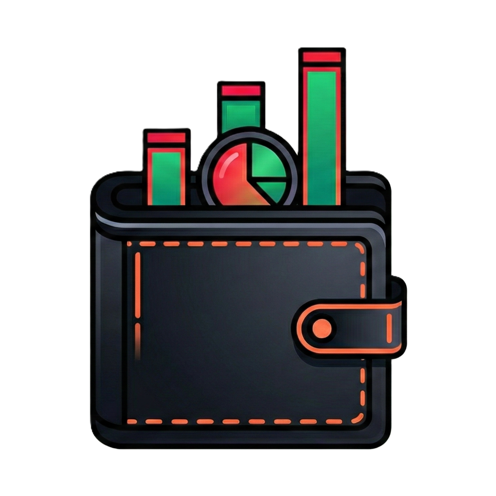

<p align="center">
  
  <h1 align="center">Earnslate</h1>
  <p align="center">
    <strong>Personal Finance Manager</strong><br/>
    Track income, expenses, budgets, and subscriptions with a premium monochrome interface.
  </p>
</p>

<p align="center">
  
  
  
  
</p>

---

## ✨ Features

### 📊 Core Modules

| Module | Description |
|--------|-------------|
| **Dashboard** | Real-time balance, spending breakdown pie chart, budget alerts |
| **Transactions** | Full CRUD with search, filters, date presets, pagination, batch delete |
| **Budgets** | Progress tracking, donut chart overview, auto-reset on period expiry |
| **Subscriptions** | 100+ service templates, treemap visualization, flexible billing cycles |
| **Settings** | Custom categories, theme toggle, data export/import |

### 🎨 Premium UX

- **Date Range Presets**: Today, This Week, This Month, Last 30/90 Days, Custom
- **Keyboard Shortcuts**: `Ctrl+N` (new), `Ctrl+D/T/B` (navigate), `Escape` (close)
- **Batch Operations**: Select multiple transactions for bulk delete
- **Service Templates**: Netflix, Spotify, AWS, ChatGPT, and 100+ more with brand icons
- **Icon Picker**: 120+ searchable Lucide icons for custom items
- **Color Picker**: 12-color palette for personalization
- **Dark/Light Theme**: System preference or manual toggle

### 🔒 Privacy First

- **Local Storage**: All data persists in browser localStorage
- **No Account Required**: Works offline, no sign-up needed
- **Full Ownership**: Export/import your data as JSON anytime

---

## 🚀 Quick Start

```bash
# Clone the repository
git clone https://github.com/yourusername/earnslate.git
cd earnslate/earnslate-app

# Install dependencies
npm install

# Start development server
npm run dev
```

Open [http://localhost:3000](http://localhost:3000) in your browser.

---

## 🛠️ Tech Stack

| Layer | Technology |
|-------|------------|
| **Framework** | Next.js 15 (App Router) |
| **Language** | TypeScript 5 |
| **State** | Zustand + localStorage persistence |
| **Styling** | CSS Modules (no Tailwind) |
| **Icons** | Iconify + Lucide React |
| **Charts** | Custom SVG (no chart library) |

---

## 📁 Project Structure

```
earnslate/
├── earnslate-app/
│   ├── src/
│   │   ├── app/              # Next.js pages and layouts
│   │   │   ├── page.tsx      # Dashboard
│   │   │   ├── transactions/ # Transaction list & charts
│   │   │   ├── budgets/      # Budget management
│   │   │   ├── subscriptions/# Subscription tracking
│   │   │   └── settings/     # User preferences
│   │   ├── components/       # Reusable UI components
│   │   │   ├── DynamicIcon/  # Unified icon renderer
│   │   │   ├── Modal/        # Accessible modal dialog
│   │   │   └── Toast/        # Notification system
│   │   ├── hooks/            # Custom React hooks
│   │   ├── store/            # Zustand state management
│   │   ├── types/            # TypeScript definitions
│   │   └── data/             # Service templates & constants
│   └── public/               # Static assets
├── CHANGELOG.md              # Version history
├── TASKS.md                  # Roadmap & future enhancements
└── AGENTS.md                 # AI agent guidelines
```

---

## ⌨️ Keyboard Shortcuts

| Shortcut | Action |
|----------|--------|
| `Ctrl + N` | New transaction |
| `Ctrl + D` | Go to Dashboard |
| `Ctrl + T` | Go to Transactions |
| `Ctrl + B` | Go to Budgets |
| `Escape` | Close modal dialogs |

---

## 📋 Roadmap

See [TASKS.md](./TASKS.md) for the full roadmap.

### 🚀 Coming Soon

| Priority | Feature | Description |
|----------|---------|-------------|
| **High** | PWA Offline Support | Install as app, works without internet |
| **Medium** | Cloud Sync | Optional Supabase sync across devices |
| **Medium** | Recurring Transactions | Auto-create transactions on schedule |
| **Low** | Multi-Currency | Track finances in multiple currencies |

### 🎨 Planned Improvements
- Universal icon picker (all Iconify libraries)
- Subscription due notifications
- Data export to PDF/Excel
- Enhanced empty states with illustrations

---

## 🤝 Contributing

1. Fork the repository
2. Create a feature branch (`git checkout -b feat/amazing-feature`)
3. Commit your changes (`git commit -m 'feat: add amazing feature'`)
4. Push to the branch (`git push origin feat/amazing-feature`)
5. Open a Pull Request

Please follow the guidelines in [AGENTS.md](./AGENTS.md) for code style and commit conventions.

---

## 📄 License

This project is licensed under the MIT License - see the [LICENSE](./LICENSE) file for details.

---

<p align="center">
  Made with ❤️ for personal finance tracking
</p>
